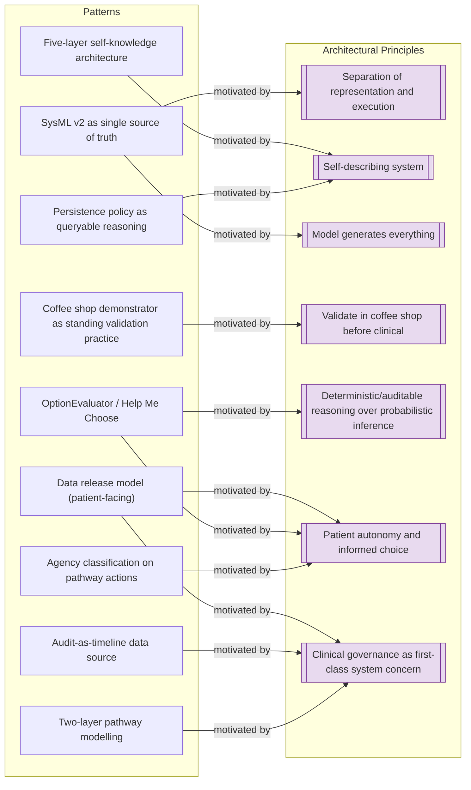
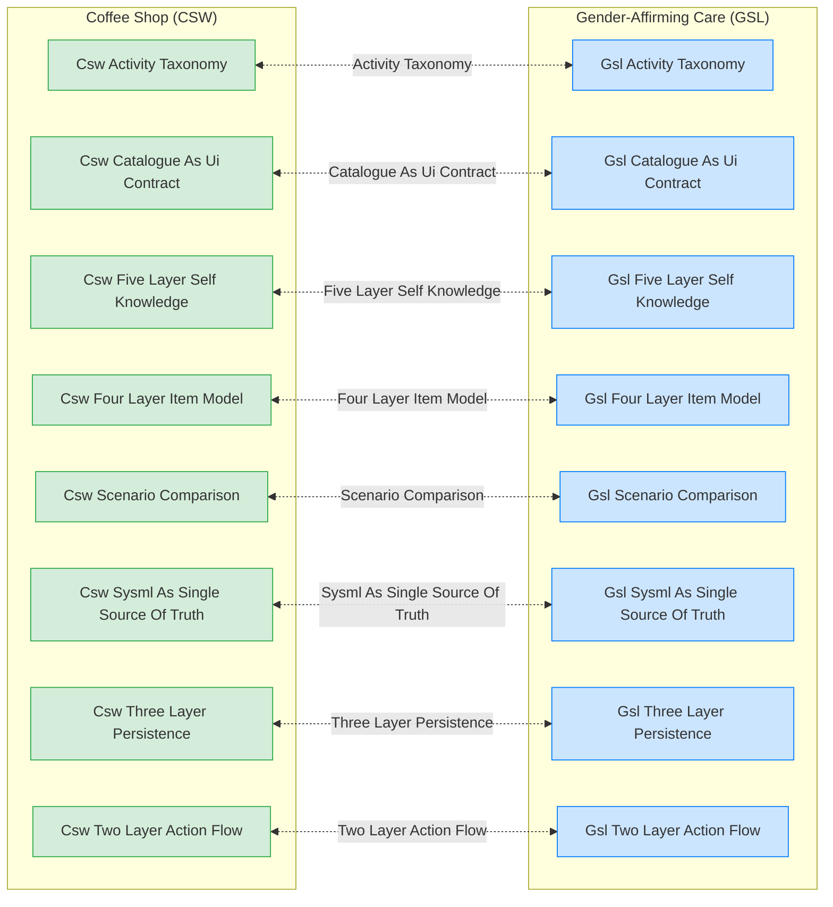

# Concept Graph — Generated Views

*Generated from `pattern-catalogue.sysml` (30 patterns, 51 relationships from SysML).*

## Overview

```mermaid
graph TD

    subgraph BM["Business Meta Model"]
        direction TB
        fourLayerItemModel["Four-layer item model"]
        activityTaxonomy["Activity taxonomy"]
        scenarioComparisonProjection["Scenario comparison and projection"]
        persistencePolicyAsReasoning["Persistence policy as queryable reasoning"]
    end

    subgraph BSM["Business System Meta Model"]
        direction TB
        sysmlAsSingleSourceOfTruth["SysML v2 as single source of truth"]
        twoLayerActionFlow["Two-layer pathway modelling"]
        fiveLayerSelfKnowledge["Five-layer self-knowledge architecture"]
        threeLayerPersistence["Three-persistence-layer architecture"]
        metadataDrivenGeneration["Metadata-driven generation"]
        xstateInTemporal["XState in Temporal"]
        catalogueAsUiContract["Catalogue-as-UI-contract"]
        kanbanAsProcessDashboard["Kanban-as-process-dashboard"]
        splitViewManagementLayout["Split-view management layout"]
        categoryConditionalFormFields["Category-conditional form fields"]
        crossPageDataConsistency["Cross-page data consistency"]
        auditAsTimelineDataSource["Audit-as-timeline data source"]
        processDomainGovernanceUnifiedView["Process + domain + governance unified view"]
        cdrSourceProvenanceBadges["CDR source provenance badges"]
        autoLoadingEntityViews["Auto-loading entity views"]
        infrastructureHealthAsAppConcern["Infrastructure health as application-level concern"]
        multiSourceMetricsAggregation["Multi-source metrics aggregation with graceful degradation"]
        twoLayerModelVisualisation["Two-layer model visualisation in the UI"]
        handCraftedSvgForStablePathways["Hand-crafted SVG for stable pathway diagrams"]
    end

    subgraph CC["Cross-Cutting"]
        direction TB
        coffeeshopDemonstratorAsPractice["Coffee shop demonstrator as standing validation practice"]
    end

    subgraph DEF["Deferred / Conceptual"]
        direction TB
        compositeOrderOrchestration["Composite order / multi-workflow orchestration"]:::deferred
        agencyClassificationOnActions["Agency classification on pathway actions"]:::deferred
        selfAssessmentDashboard["Self-assessment dashboard (KL Increment 3)"]:::deferred
        optionEvaluatorHelpMeChoose["OptionEvaluator / Help Me Choose"]:::deferred
        dataReleaseModel["Data release model (patient-facing)"]:::deferred
        notificationTriggersOnTransitions["Notification triggers on state transitions"]:::deferred
    end

    fourLayerItemModel -.->|enables| persistencePolicyAsReasoning
    fourLayerItemModel -.->|enables| catalogueAsUiContract
    persistencePolicyAsReasoning -->|depends on| fourLayerItemModel
    persistencePolicyAsReasoning -->|depends on| threeLayerPersistence
    sysmlAsSingleSourceOfTruth -.->|enables| metadataDrivenGeneration
    twoLayerActionFlow -->|generalises| compositeOrderOrchestration
    fiveLayerSelfKnowledge -.->|enables| scenarioComparisonProjection
    coffeeshopDemonstratorAsPractice -.->|validates| twoLayerActionFlow
    coffeeshopDemonstratorAsPractice -.->|validates| fourLayerItemModel
    coffeeshopDemonstratorAsPractice -.->|validates| threeLayerPersistence
    coffeeshopDemonstratorAsPractice -.->|validates| catalogueAsUiContract
    threeLayerPersistence -.->|enables| persistencePolicyAsReasoning
    metadataDrivenGeneration -.->|enables| xstateInTemporal
    metadataDrivenGeneration -.->|enables| twoLayerActionFlow
    catalogueAsUiContract -->|depends on| fourLayerItemModel
    kanbanAsProcessDashboard -->|depends on| xstateInTemporal
    splitViewManagementLayout <-->|composed| kanbanAsProcessDashboard
    splitViewManagementLayout <-->|composed| autoLoadingEntityViews
    categoryConditionalFormFields -->|depends on| catalogueAsUiContract
    crossPageDataConsistency -->|depends on| catalogueAsUiContract
    auditAsTimelineDataSource -->|depends on| twoLayerActionFlow
    processDomainGovernanceUnifiedView -->|depends on| twoLayerActionFlow
    processDomainGovernanceUnifiedView -->|depends on| xstateInTemporal
    cdrSourceProvenanceBadges -->|depends on| threeLayerPersistence
    autoLoadingEntityViews -->|depends on| threeLayerPersistence
    multiSourceMetricsAggregation -->|depends on| threeLayerPersistence
    multiSourceMetricsAggregation -->|depends on| infrastructureHealthAsAppConcern
    twoLayerModelVisualisation -->|depends on| twoLayerActionFlow
    handCraftedSvgForStablePathways -->|extends| twoLayerModelVisualisation
    compositeOrderOrchestration -->|depends on| xstateInTemporal
    compositeOrderOrchestration -->|depends on| twoLayerActionFlow
    agencyClassificationOnActions -->|depends on| twoLayerActionFlow
    agencyClassificationOnActions -.->|enables| optionEvaluatorHelpMeChoose
    selfAssessmentDashboard -->|depends on| fiveLayerSelfKnowledge
    selfAssessmentDashboard -->|depends on| infrastructureHealthAsAppConcern
    optionEvaluatorHelpMeChoose -->|depends on| fiveLayerSelfKnowledge
    dataReleaseModel -->|depends on| threeLayerPersistence
    dataReleaseModel -->|depends on| agencyClassificationOnActions
    notificationTriggersOnTransitions -->|depends on| xstateInTemporal

    classDef deferred stroke-dasharray: 5 5,fill:#fce4ec
```

## Dependencies

```mermaid
graph TD

    catalogueAsUiContract["Catalogue-as-UI-contract"]:::validated
    threeLayerPersistence["Three-persistence-layer architecture"]:::validated
    fiveLayerSelfKnowledge["Five-layer self-knowledge architecture"]:::validated
    auditAsTimelineDataSource["Audit-as-timeline data source"]:::validated
    cdrSourceProvenanceBadges["CDR source provenance badges"]:::validated
    twoLayerModelVisualisation["Two-layer model visualisation in the UI"]:::validated
    notificationTriggersOnTransitions["Notification triggers on state transitions"]:::discussion
    processDomainGovernanceUnifiedView["Process + domain + governance unified view"]:::validated
    crossPageDataConsistency["Cross-page data consistency"]:::validated
    compositeOrderOrchestration["Composite order / multi-workflow orchestration"]:::discussion
    kanbanAsProcessDashboard["Kanban-as-process-dashboard"]:::validated
    optionEvaluatorHelpMeChoose["OptionEvaluator / Help Me Choose"]:::designed
    autoLoadingEntityViews["Auto-loading entity views"]:::validated
    multiSourceMetricsAggregation["Multi-source metrics aggregation with graceful degradation"]:::validated
    persistencePolicyAsReasoning["Persistence policy as queryable reasoning"]:::validated
    xstateInTemporal["XState in Temporal"]:::validated
    categoryConditionalFormFields["Category-conditional form fields"]:::validated
    agencyClassificationOnActions["Agency classification on pathway actions"]:::designed
    twoLayerActionFlow["Two-layer pathway modelling"]:::validated
    infrastructureHealthAsAppConcern["Infrastructure health as application-level concern"]:::validated
    fourLayerItemModel["Four-layer item model"]:::validated
    dataReleaseModel["Data release model (patient-facing)"]:::discussion
    selfAssessmentDashboard["Self-assessment dashboard (KL Increment 3)"]:::designed

    persistencePolicyAsReasoning --> fourLayerItemModel
    persistencePolicyAsReasoning --> threeLayerPersistence
    catalogueAsUiContract --> fourLayerItemModel
    kanbanAsProcessDashboard --> xstateInTemporal
    categoryConditionalFormFields --> catalogueAsUiContract
    crossPageDataConsistency --> catalogueAsUiContract
    auditAsTimelineDataSource --> twoLayerActionFlow
    processDomainGovernanceUnifiedView --> twoLayerActionFlow
    processDomainGovernanceUnifiedView --> xstateInTemporal
    cdrSourceProvenanceBadges --> threeLayerPersistence
    autoLoadingEntityViews --> threeLayerPersistence
    multiSourceMetricsAggregation --> threeLayerPersistence
    multiSourceMetricsAggregation --> infrastructureHealthAsAppConcern
    twoLayerModelVisualisation --> twoLayerActionFlow
    compositeOrderOrchestration --> xstateInTemporal
    compositeOrderOrchestration --> twoLayerActionFlow
    agencyClassificationOnActions --> twoLayerActionFlow
    selfAssessmentDashboard --> fiveLayerSelfKnowledge
    selfAssessmentDashboard --> infrastructureHealthAsAppConcern
    optionEvaluatorHelpMeChoose --> fiveLayerSelfKnowledge
    dataReleaseModel --> threeLayerPersistence
    dataReleaseModel --> agencyClassificationOnActions
    notificationTriggersOnTransitions --> xstateInTemporal

    classDef validated fill:#2d6a4f,color:#fff,stroke:#1b4332
    classDef implemented fill:#40916c,color:#fff,stroke:#2d6a4f
    classDef designed fill:#e9c46a,color:#000,stroke:#f4a261
    classDef discussion fill:#e76f51,color:#fff,stroke:#e63946
```

## Motivation

## Analogues

## Maturity

